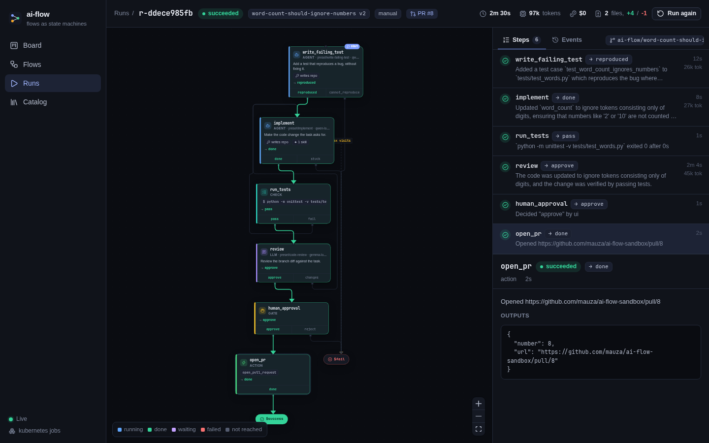

# ai-flow

Every task gets its own state machine. A planner model turns a task (from Linear
or the UI) into a **flow** — small steps like *write a failing test → fix it →
run the tests → review the diff → open a PR*, with loops and human gates where
they make sense. Each step runs as an isolated Kubernetes Job with only the
model, tools, MCP tools and repo access it declares; git, LLM and MCP traffic go
through the control plane, so pods never hold credentials.

Small steps mean small models: the flows in this repo run on local Gemma/Qwen.



## Quick start (kind)

Needs Docker, kind, kubectl, helm, Go, Node, and `gh` logged in.

```sh
cp .env.example .env          # LINEAR_API_KEY (optional); GITHUB_TOKEN defaults to `gh auth token`
make dev-up                   # kind cluster + images + Helm release
open http://localhost:8080
```

Then press **New task**, or add the trigger label to a Linear issue. Change code
and run `make dev-reload`. `make dev-down` deletes the cluster.

No cluster? `make dev-local` runs the control plane on your machine and each
step as a child process (no isolation; good for iterating).

## How it fits together

```
Linear / UI ──▶ planner ──▶ flow YAML (versioned) ──▶ engine ──▶ Job per step
                                                        ▲            │
                              gates · switches · PRs ───┘            ▼
                                                     broker: git · LLM · MCP proxies
```

- **Flows** are YAML ([format](docs/SPEC.md#4-flow-format), [examples](examples/)).
  The UI edits them as a graph, as YAML, or by chatting with the planner.
- **Node types**: `llm` (one structured call), `agent` (pi coding agent),
  `check` (shell command), `gate` (human decision), `switch` (CEL), `action`
  (open a PR, comment on the task).
- **Per-step models and limits**: each step picks a model from the catalog and
  says what happens on rate limits, quota, context overflow or budget:
  retry, wait, fall back to another model, route to another node, or fail.
- **Grants**: a step gets exactly the repo access (read, or write to its run
  branch only), MCP tools, secrets and egress it lists. Pods reach nothing but
  the control plane's pod port.
- **Config** lives in [`deploy/config`](deploy/config): the environment (where
  things run), the catalog (the menu the planner picks from) and projects (repo,
  allow-lists, budgets, start mode, planner guidance, Linear link).

Read [docs/SPEC.md](docs/SPEC.md) for the design, the security model and what
changed from the original draft.

## Commands

| | |
|---|---|
| `make dev-up` / `dev-reload` / `dev-down` | kind cluster lifecycle |
| `make dev-local` | control plane + demo MCP server on the host, steps as processes |
| `make test` / `make lint` | Go tests / vet + helm lint |
| `ai-flow validate -config deploy/config flow.yaml` | validate a flow |
| `ai-flow plan -config deploy/config -project sandbox -title "..."` | try the planner |
| `cd web && npm run dev` | UI with hot reload, proxied to a control plane on :8080 |

## Layout

```
cmd/ai-flow        the one binary: server, node (pod entrypoint), validate, plan, mcp-demo
internal/          engine, broker (git/LLM/MCP proxies), runner (node-runner + limit shim),
                   planner, resolve (validation), intake (Linear), store (SQLite), ...
pi-ext/            pi extension: flow_finish + granted MCP tools
web/               React UI (embedded into the binary)
deploy/            Helm chart, kind config, images, config for kind and local mode
examples/          flows: MCP grant, token limits, sandbox red-team probe
```
