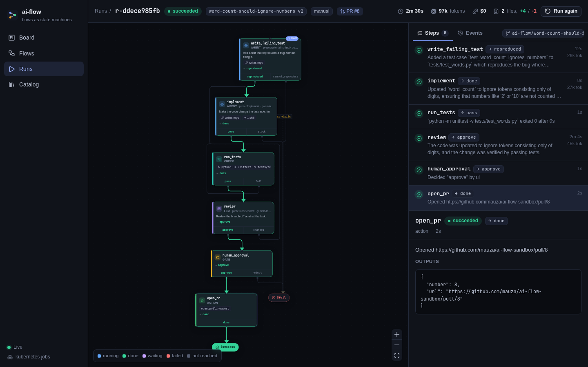

# ai-flow

Every task gets its own state machine. A planner model turns a task (from Linear,
the UI, or a user story map) into a **flow**: small steps like *write a failing
test → fix it → run the tests → review the diff → open a PR → merge → watch the
deploy*, with loops and human gates where they make sense. Each step runs as an
isolated Kubernetes Job with only the model, tools, MCP tools, secrets and repo
access it declares; git, LLM and MCP traffic go through the control plane, so
pods never hold those credentials.

Models come from any OpenAI-compatible endpoint (OpenAI, OpenRouter, a LiteLLM
gateway, vLLM, llama.cpp, Ollama). The example catalog in
[`deploy/config`](deploy/config) offers GPT-6.1 Sol (the default planner), GPT-6
Luna and GPT-6 Astra; edit the models in **Settings** to match your endpoint. A
model's capability fields are hints for the planner, not performance claims.



## Quick start (kind)

Needs Docker on an x86-64 machine, kind, kubectl, helm, Go, Node, `gh` logged
in, and an OpenAI-compatible model endpoint.

```sh
cp .env.example .env          # LLM_BASE_URL / LLM_API_KEY for your model endpoint
make dev-up                   # kind cluster + images + Helm release
open http://localhost:8080
```

Then match the catalog's models to your endpoint in **Settings**, link a
repository under **Products**, and create a task. [docs/LOCAL-KIND.md](docs/LOCAL-KIND.md)
walks through each step, day-to-day commands and troubleshooting.

No cluster? `make dev-local` runs the control plane on your machine and each
step as a child process (no isolation; good for iterating).

## How it fits together

```
Linear / UI / story map ──▶ planner ──▶ flow YAML (versioned) ──▶ engine ──▶ Job per step
                                                                    ▲            │
                         gates · switches · PRs · deploys ──────────┘            ▼
                                                                 broker: git · LLM · MCP proxies
```

- **Flows** are YAML ([format](docs/SPEC.md#4-flow-format), [examples](examples/)).
  The UI edits them as a graph, as YAML, or by chatting with the planner.
- **Node types**: `llm` (one structured call), `agent` (pi coding agent),
  `check` (shell command, optionally with structured JSON outputs), `gate` (human
  decision with an optional note), `switch` (CEL), `action` (built-in: open,
  merge or comment on a PR, wait for CI, a deploy or a health soak, roll back),
  and `parallel` + `join` (run read-only branches at once, then route on all
  their results). The [node catalog](docs/NODE-CATALOG.md) lists the presets.
- **Release pipelines**: for a project whose `deploy` config says merging
  ships it, the validator requires CI before a merge and a deploy check plus a
  health soak after it; a failed soak can roll back without a rebuild.
- **Per-step models and limits**: each step picks a model from the catalog and
  says what happens on rate limits, quota, context overflow or budget:
  retry, wait, fall back to another model, route to another node, or fail.
- **Grants**: a step gets exactly the repo access (read, or write to its run
  branch only), MCP tools, secrets and egress it lists. Pods reach nothing but
  the control plane's pod port.
- **Config** starts in [`deploy/config`](deploy/config): the environment (where
  things run), the catalog (the menu the planner picks from) and projects (repo,
  allow-lists, budgets, start mode, planner guidance, Linear link, deploy). On
  first start the server copies the catalog and projects into its database, and
  **Settings** edits them live from then on; entries changed in the files still
  apply at the next start, and the environment stays in files.
- **Product work**: link a GitHub repository, write product docs and user story
  maps in its `product/` directory, and send user tasks, activities or phases
  to flows. Edits stay in a scratch checkout until you commit
  ([docs/PRODUCT.md](docs/PRODUCT.md)).
- **Run review**: an LLM reads a run's record and suggests changes to the flow,
  the catalog or ai-flow's primitives.

Read [docs/SPEC.md](docs/SPEC.md) for the design, the security model and what
changed from the original draft.

## Templates and evaluations

Start with a reusable [flow template](docs/TEMPLATES.md): **test → implement →
verify**, **investigate → propose → approve**, **review → repair**, or a
**release pipeline** (CI → merge → deploy → health soak → rollback). Replace the
validation-only project/runtime/grant placeholders with your catalog choices,
then validate against your config. `make test-templates` validates them all
offline with the real flow parser and resolver.

The standalone [`ai-flow-eval`](docs/EVALUATIONS.md) command scores exported
run/visit API JSON against pinned flow versions, explicit outcome/output checks
and resource limits, then compares machine-readable reports to a baseline.
Evaluation pass rate is distinct from run success status. Reports include
duration, reported cost/tokens, per-node failures and explicitly defined gate
correction counts. The included examples are **synthetic fixtures, not model
benchmark results**:

```sh
make build-eval
./bin/ai-flow-eval -suite examples/evals/baseline-suite.json > /tmp/baseline.json
./bin/ai-flow-eval -suite examples/evals/candidate-suite.json \
  -baseline /tmp/baseline.json > /tmp/candidate.json  # intentional regression; exits 1
```

CI runs Go tests/race/vet, frontend install/build and desktop/mobile browser tests, Helm
lint/render for default and kind values with both secret modes, synthetic
evaluation checks and git diff checks. No live model or production access is
needed for evaluations or template validation.

See [reliability and recovery](docs/RELIABILITY.md) for restart behavior,
execution snapshots, readiness, budget semantics and transcript limits.

## Commands

| | |
|---|---|
| `make dev-up` / `dev-reload` / `dev-down` | kind cluster lifecycle (state survives `dev-down`) |
| `make dev-reset` | delete the cluster and its state |
| `make dev-local` | control plane + demo MCP server on the host, steps as processes |
| `make test` / `make lint` | Go tests / vet + helm lint |
| `make test-race` / `make helm-check` | Go race detector / offline default+kind Helm lint and rendering |
| `make build-eval` / `make test-eval` | build standalone evaluator / evaluator and fixture tests |
| `make test-templates` / `make eval-demo` | offline template validation / synthetic passing evaluation JSON |
| `ai-flow validate -config deploy/config flow.yaml` | validate a flow |
| `ai-flow plan -config deploy/config -project sandbox -title "..."` | try the planner |
| `cd web && npm run dev` | UI with hot reload, proxied to a control plane on :8080 |
| `cd web && npx playwright install chromium && npm test` | desktop/mobile UI regressions against a mocked API (or set `PLAYWRIGHT_CHROMIUM_EXECUTABLE`) |

## Layout

```
cmd/ai-flow        main binary: server, node (pod entrypoint), validate, plan, mcp-demo
cmd/ai-flow-eval   standalone offline export evaluator and baseline comparison
internal/
  app              use cases shared by the API and intake: tasks, planning, config
                   edits, product work, map assistant, run review
  engine           the state-machine interpreter and built-in actions
  broker           the pod-facing port: token exchange, results, git/LLM/MCP proxies
  runner           the pod entrypoint (node-runner) and its limit shim
  planner, resolve task → flow; presets/defaults resolution and validation
  config, store    config documents; SQLite (tasks, flows, runs, visits, kv)
  server           HTTP API, SSE and the embedded UI
  workspace        scratch checkouts of a repo's product/ through the GitHub API
  storymap         user story map files
  github, linear, metrics, launcher, mcpx, objstore, notify, ...   integrations
pi-ext/            pi extension: flow_finish + granted MCP tools
web/               React UI (embedded into the binary)
deploy/            Helm chart, kind config, images, config for kind, local and prod
examples/          flows: MCP grant, token limits, sandbox red-team probe
                   templates/ (reusable flows), evals/ (synthetic evaluation fixtures)
docs/              LOCAL-KIND (setup), SPEC (design), PRODUCT, NODE-CATALOG, RELIABILITY,
                   LOOPS, TEMPLATES, EVALUATIONS
```
