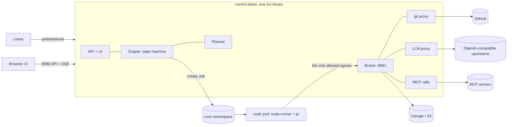

# ai-flow — Task Flows as State Machines

Status: implemented (v2) · 2026-09-25

## 1. What it is

Every task gets its own small state machine — a **flow**. A model (the planner)
drafts the flow; each node is one narrow step: a single LLM call, a coding-agent
session (pi), a deterministic check, a human gate, a CEL switch, or a built-in
action. Steps are small enough that local models run most of them. Flows are
YAML; the UI shows them as a graph you can edit by hand or by chatting with the
planner. Runs execute each pod step as a Kubernetes Job with exactly the tools,
skills, MCP tools, models and repo access that step declares — and no raw
credentials: git, LLM and MCP traffic all go through the control plane, which
holds the secrets and re-checks every request against the step's grant.

Everything runs in one local kind cluster (`make dev-up`) or any other cluster
with the same Helm chart. External services (a home LiteLLM, R2, GitHub, Linear)
are plain URLs in config.

## 2. Concepts

| Term | Meaning |
|---|---|
| **Task** | Unit of intent: from Linear (label + state trigger) or created in the UI. |
| **Flow** | Versioned YAML state machine for one task. Every save is a new version; runs pin one. |
| **Node** | One step. Emits exactly one **outcome** from its enum, plus typed **outputs**. |
| **Transition** | `outcome → next node` (or `$success` / `$fail`). Only enum outcomes route; free text never does. |
| **Visit** | One execution of a node in a run. Loops create `fix#1`, `fix#2`, … |
| **Catalog** | The menu: models, runtimes (images), grants, skills, presets, planner settings. |
| **Grant** | A named capability: git repo (read/write), MCP server + tool subset, k8s secret, egress. |
| **Project** | Repo, allowed grants/models, budgets, start mode, planner guidance, Linear link. |

## 3. Architecture



Components (all in `ai-flow`, one binary and image, plus the agent runtime image):

| Component | Package | Job |
|---|---|---|
| Engine | `internal/engine` | Interprets runs: one active node at a time, visits, max_visits, gates, switch, actions, retries of crashed pods, concurrency limit. |
| Launcher | `internal/launcher` | Kubernetes Jobs (prod/kind) or child processes (`-local`). |
| Broker | `internal/broker` | Pod-facing port: token exchange, results, progress, transcripts, LLM proxy, git proxy, MCP calls. |
| Node-runner | `internal/runner` | Pod entrypoint: exchange, clone via proxy, run node, commit + push, report. |
| Limit shim | `internal/runner/shim.go` | In-pod OpenAI-compatible proxy applying the step's `on_limit` policy. |
| pi extension | `pi-ext/index.ts` | `flow_finish` tool + granted MCP tools as native pi tools. |
| Planner | `internal/planner` | Task → flow YAML with a validator repair loop; chat revisions. |
| Validator | `internal/resolve` | Presets/defaults resolution, validation, graph projection. Shared by planner, UI, CLI, engine. |
| Intake | `internal/intake` | Linear polling, status + comment mirroring. |
| Store | `internal/store` | SQLite: tasks, flow versions, runs, visits, events, chat. |
| UI | `web/` | React + React Flow + ELK + CodeMirror, embedded in the binary. |

### Off the shelf

pi (agent harness), Kubernetes Jobs + NetworkPolicy + TokenReview, Garage (object
store), any OpenAI-compatible model server (LiteLLM, llama.cpp, vLLM, Ollama…),
the MCP Go SDK, CEL (`cel-go`), React Flow + ELK.js, CodeMirror, the `yaml` library.

## 4. Flow format

```yaml
apiVersion: ai-flow/v1alpha1
kind: Flow
metadata:
  name: fix-slugify-digits          # lowercase-dashes
  project: sandbox
  task: { source: linear, id: MAU-22 }
  start: manual                     # optional: overrides the project's start mode
spec:
  description: Keep digits in slugify output.
  repo: { grant: repo/ai-flow-sandbox, base: main }   # optional: defaults to the project repo
  budget: { usd: 4.00 }
  defaults: { runtime: agent-base, timeout: 20m }      # optional per-flow node defaults
  start: reproduce
  nodes:
    <id>:                           # lowercase_snake_case
      type: llm | agent | check | gate | switch | action
      uses: preset/<name>           # node fields override the preset
      description: why this step exists
      model: <catalog model>        # shorthand for llm.model
      llm:                          # full model config, §4.3
      harness: pi                   # agent nodes (default pi)
      runtime: <catalog runtime>
      grants: [repo/x:write, mcp/y]
      skills: [small-diffs]
      inputs: { test: "${{ nodes.reproduce.outputs.test_name }}" }
      prompt: |                     # llm/agent instructions; gate question
      outputs: { summary: string, files: [string], count: number }
      outcomes: [done, stuck]
      next: { done: test, stuck: $fail }
      max_visits: 3                 # required on some node of every loop (gates count too)
      on_exhausted: escalate        # default $fail
      timeout: 30m                  # pod nodes; on gates it adds a `timeout` outcome
      retry: { limit: 1 }           # infra retries of the pod (Job backoffLimit)
      run: python -m unittest -v    # check
      exit_codes: { "0": pass, default: fail }   # check (this is the default)
      cases: [{ when: "run.diff.files_changed > 15", outcome: big }]   # switch
      default: small                # switch
      action: open_pull_request     # action: open_pull_request | comment_task
      with: { title: "${{ task.title }}", body: "...", draft: false }
```

### 4.1 Node types

| Type | Runs where | Outcome from |
|---|---|---|
| `llm` | pod | One chat completion with a JSON-schema response format (`{outcome, summary, outputs}`); the branch diff is included. |
| `agent` | pod | pi session in the repo; ends with the `flow_finish` tool. One nudge if the agent forgets. |
| `check` | pod | `bash -o pipefail -c <run>`; exit code → `exit_codes`. Outputs `exit_code`, `log_tail`. |
| `gate` | control plane | A human picks an outcome in the UI; optional timeout. |
| `switch` | control plane | First matching CEL case, else `default`. |
| `action` | control plane | `open_pull_request` (idempotent; PR body includes a step table) or `comment_task`. |

Implicit outcomes: `timeout` on gates with a timeout; `limit` on llm/agent nodes
whose `on_limit` uses `action: outcome`.

### 4.2 Templates and context

`${{ path ?? "fallback" }}` with roots `task`, `run` (`id`, `branch`, `base`,
`diff.files_changed|lines_added|lines_removed|lines_changed`, `last_node`),
`nodes.<id>.{outcome,summary,outputs.<f>}` (latest visit) and `inputs`. Rendered
once, in the control plane, so model output is never re-evaluated. CEL switch
expressions see the same values.

Every pod node also receives a context section: the task, a list of earlier steps
with outcomes and summaries, the previous step's outputs and log tail, its inputs,
and the branch diff stats.

### 4.3 Model config and limits per step

```yaml
llm:
  model: qwen-local
  fallbacks: [gemma-local]
  thinking: medium
  limits: { tokens: 400000, usd: 0.50, turns: 80 }
  on_limit:
    rate_limited:     { action: retry, max: 5, backoff: 20s, then: fallback }
    quota_exhausted:  { action: wait, max_wait: 2h, then: fallback }
    context_exceeded: { action: fallback }
    budget_exceeded:  { action: outcome }     # emits `limit`; route it in next
```

Actions: `retry` (exponential backoff, honours `Retry-After`), `wait` (until the
upstream's reset time, capped by `max_wait`), `fallback` (next model), `outcome`
(stop, emit `limit`), `fail` (step error → run fails). `then` chains. Layering:
node → preset → flow/project/catalog defaults → catalog model → built-in defaults
(rate_limited: retry ×5 then fail; quota: wait 30m then fail; others: fail).

Two enforcement points: the **limit shim** in the pod (behaviour: retries,
waits, fallbacks, token/turn limits) and the **LLM proxy** in the control plane
(security: model allowlist from the grant, node `limits.usd`, flow `budget.usd`,
project per-run and per-month caps, usage accounting).

## 5. Configuration

A config directory of YAML documents, each with a `kind`; later files override
earlier `Environment`/`Catalog` documents (`-config deploy/config -config local.yaml`).
Secrets are env vars named by `*Env` fields, never inlined.

- **Environment** — where things run: listen ports, public URL, pod URL, runs
  namespace, concurrency, LLM upstreams (`baseUrl`, `apiKeyEnv`), object store
  (`garage` | `s3` | `local`), git host tokens, GitHub API, Linear connection,
  MCP servers (URL + headers).
- **Catalog** — models (upstream + model id + planner metadata + default `llm`),
  harnesses, runtimes, grants, skills (inline files or a directory), presets,
  node defaults, planner (model, guidance, attempts).
- **Project** — repo grant, base branch, `start: manual|auto`, allow-lists for
  grants and models (glob patterns), budgets, planner guidance, Linear link:
  team, optional project filter, trigger label + states, state mapping, comments.

The kind setup lives in `deploy/config`; `deploy/local/environment.yaml` layers
local-process mode on top.

## 6. Planning

1. A task arrives (Linear poll or UI). The planner gets: rules and the flow format,
   the catalog filtered by the project's allow-lists, global + project guidance
   (how much the human wants to be in the loop), an example flow, and repo context
   from GitHub (file tree, AGENTS.md, CLAUDE.md, README.md).
2. The reply's YAML block is parsed, identity fields are pinned, the flow is
   re-rendered in a stable layout and validated. Errors go back to the model
   (up to `planner.max_attempts`).
3. The result is saved as a version (even with errors, so a human can fix it) and
   the explanation is stored as the first chat message. With `start: auto` a valid
   flow runs immediately.
4. Chat revisions send the current editor YAML, validation findings and recent
   chat history; the UI shows the proposal as a diff to apply, then you save.

No gate is mandatory. The guidance text decides when the planner adds gates, and
it must justify them in the gate's `description`.

Validation (planner, UI, CLI, engine): schema, ids, start, every outcome routed,
no stray `next` keys, targets exist, reachability, every node can reach a
terminal, every cycle bounded (`max_visits` or a gate), models/runtimes/harnesses/
skills/presets/actions exist, grants and models allowed by the project, CEL
compiles, template references resolve, output types valid, budget ≤ project cap.

## 7. Execution

### 7.1 Engine

A run is a pinned flow version with one active node. The engine loop (every 3s
and on demand) starts queued runs up to `runs.maxConcurrent`, then for each
active run looks at its latest visit:

- finished → follow `next[outcome]`; entering a node that already ran
  `max_visits` times goes to `on_exhausted` instead;
- a pod node whose Job ended without a result → error after a grace period;
- a gate past its deadline → `timeout` outcome.

Transitions happen only on the engine's loop; the broker and API record facts
(a result arrived, a gate was decided) and wake it. Infra errors (pod crash,
OOM, timeout) fail the run after Job retries; business failures are outcomes.

### 7.2 Node pod

Job in the runs namespace: non-root, read-only root filesystem, dropped
capabilities, RuntimeDefault seccomp, no service-account token automount, `/work`
and `/tmp` emptyDirs, CPU/memory limits, `activeDeadlineSeconds`, TTL cleanup.
Only a projected token with the `ai-flow` audience is mounted.

`ai-flow node`:

1. **Exchange** — POST the projected token. The broker runs a TokenReview, reads
   the pod's labels (run, visit), checks the visit is the current one, and
   returns the bundle: rendered prompt and context, outcomes, result schema,
   repo access, model list + `llm` config, allowed tools, MCP tool schemas,
   skills, check command, and a grant JWT scoped to this visit.
2. **Workspace** — clone through the git proxy (grant passed per command, never
   written to `.git/config`), check out the run branch (`ai-flow/<flow>-<run>`)
   or create it from base.
3. **Run** — agent: pi with an isolated config dir (`PI_CODING_AGENT_DIR`), a
   custom provider pointing at the limit shim, `--no-extensions -e <ai-flow ext>`,
   `--no-skills --skill <granted>`, `--tools <allowlist>`, JSON event stream as
   transcript and progress. llm: one structured call through the shim. check:
   bash with a minimal environment (no grant).
4. **Collect** — validate the outcome, commit and push if the node has
   `repo:write`, compute diff stats, upload the transcript, post the result.

### 7.3 Access control

| Resource | What the pod holds | Enforced by |
|---|---|---|
| Git | grant JWT | Git proxy: repo must match the grant; pushes need `:write` and may only update `refs/heads/<run-branch>` (no deletes, no other refs); rejected pushes answer with git's report-status so the client prints why. Upstream token injected by the proxy. |
| Models | grant JWT | LLM proxy: model ∈ grant (node model + fallbacks), budgets, upstream key injected, usage recorded per visit and run. |
| MCP | grant JWT | Broker calls the tool only if `server/tool` ∈ grant; upstream credentials live in the environment config. |
| Secrets | the one mounted key | Only secrets named by the node's `secret` grants and allowed by the project. |
| Network | nothing | NetworkPolicy: node pods may reach DNS and the control plane's pod port (8081), nothing else. `egress` grants with `allow: internet` open public internet (private ranges still blocked). |
| Kubernetes API | nothing | No automounted token; the runner service account has no RBAC. |

Every pod node can read the flow's repo; writing requires `repo:write`.
A pod can re-exchange its own token — which only yields its own visit's grant.

`examples/redteam.yaml` probes all of this from inside a pod (16 checks).

## 8. State between nodes

| Kind | Where |
|---|---|
| Outcome, outputs, summary | Visit rows (SQLite); templates and context read the latest visit per node. |
| Code | The run branch, pushed after each writing node. Diff stats flow into `run.diff`. |
| Transcripts, check output | Object store (`runs/<run>/<seq>-<node>.jsonl`), shown in the UI. |

## 9. Intake (Linear)

Polls each linked project (poll mode needs no public URL). In webhook mode,
`POST /webhooks/linear` (HMAC-verified) triggers an immediate poll and polling
drops to every 5 minutes as a safety net. An issue in a trigger
state with the trigger label becomes a task and is planned. ai-flow moves the
issue through the mapped states (planning → flow ready → running → succeeded /
failed) and comments with the flow link, then the PR link or the failure reason.
Moving a failed issue back to a trigger state re-plans it.

## 10. UI

- **Board** — tasks by stage (planning, ready, running, done, failed), new task,
  task drawer (description, runs, activity, re-plan, run).
- **Flow editor** — graph (ELK layered layout, orthogonal edges, loops, terminal
  pills, validation badges); side panel with the node inspector (model, prompt,
  access, skills, outcome → next, loops, effective settings), YAML editor with
  inline diagnostics, planner chat with diff proposals, and runs. Drag from an
  outcome to a node to route it. Versions, save (Ctrl+S), revert, run.
- **Run view** — the same graph colored live over SSE (running, done, waiting,
  failed, not reached; taken edges in green; visit counts), gate decisions,
  step timeline with progress, and step detail (result, outputs, rendered prompt,
  transcript with tool calls).
- **Catalog** — models, presets, grants, skills, runtimes, projects and guidance.

## 11. Environments

`deploy/chart` installs the control plane, the runs namespace with its service
account and NetworkPolicies, RBAC (TokenReview; Jobs/pods in the runs namespace),
Garage (bootstrapped by the control plane through its admin API), and optionally
the demo MCP server. Config files go in with `--set-file` or an existing ConfigMap;
secrets via an existing Secret (`ai-flow-secrets`).

- **kind** — `make dev-up` / `dev-reload` / `dev-down`. Images built on the host and
  loaded; UI at http://localhost:8080. State (SQLite, Garage) lives in a host
  folder (`STATE_DIR`, default `~/.local/share/ai-flow/<cluster>`) mounted into the
  node and used through `hostPath` volumes, with pods running as your uid, so it
  survives `dev-down`; `make dev-reset` removes it. kind's kindnet enforces NetworkPolicy a few
  seconds after a pod starts; use Calico/Cilium where that gap matters.
- **local processes** — `make dev-local`: no cluster, no isolation; for fast iteration.
- **prod** — same chart with real values: images from a registry, sealed secrets,
  ingress, `linear.mode: webhook` optional, S3/R2 or Garage.

## 12. Changes from the draft spec

| Draft | Built | Why |
|---|---|---|
| Compile flows to Argo Workflows (unroll loops into a DAG) | Own state-machine engine + plain Jobs | A flow has one active node at a time, so an interpreter is ~500 lines, handles loops natively, and removes a cluster-wide CRD install. Argo's value (DAG, artifacts, UI) mostly didn't apply. |
| Per-node LiteLLM virtual keys | LLM proxy in the control plane (grant = model allowlist + budgets) | Works with any OpenAI-compatible endpoint and needs no LiteLLM + Postgres; LiteLLM is still a fine upstream. |
| agentgateway for MCP | Broker calls MCP tools with the official Go SDK | One auth model (the grant) for git, LLM and MCP; no extra component to configure. |
| Flows in a git repo | Versioned YAML in SQLite, editable and exportable | Easier setup; every save is still a version and runs pin one. |
| `plan-task` meta-flow | Planner in the control plane with repo context from GitHub | Interactive latency for chat revisions; exploration by an agent can be added as a preset later. |
| Gates as Argo suspend | Gates handled by the engine | No pod waiting for a human. |

## 13. Not done yet

- `map` (fan-out) and sub-flow nodes.
- Claude Code / opencode harnesses; cloud models and subscription proxies (config
  supports any OpenAI-compatible upstream already).
- GitLab forge.
- Egress domain allowlists (today: none or public internet).
- Planner exploration by an agent; multi-repo flows.
- Auth for the UI beyond an optional shared token (`server.authTokenEnv`).
